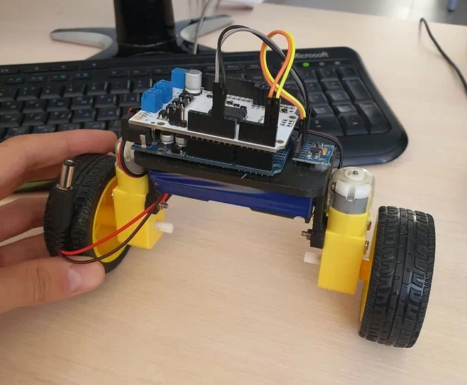

# Очень простой двухколесный робот балансировщик



Прошивка самодельного двухколесного робота балансировщика. Цель проекта: практический подбор коэффицентов PID регулятора.

## Описание
Для сборки робота понадобится:
- Arduino UNO или аналог
- Любой драйвер двигателей, у меня используется Амперковский Motor Shield (L298P)
- Модуль гироскоп акселерометр MPU6050
- Два мотор-редуктора с колесом
- Два аккумулятора 18650 с холдером
- Корпус распечатанный на 3D принтере [Скачать stl](files/body.stl)

## Сборка и запуск
1. Выполнить сборку и подключение:
- MPU6050 SCL - Arduino A5
- MPU6050 SDA - Arduino A4
- Подключить моторы и питание

2. Скачать и установить необходимые файлы и все необходимые библиотеки
- [MPU6050.h](https://github.com/ElectronicCats/mpu6050)
- [KalmanFilter.h](https://github.com/jarzebski/Arduino-KalmanFilter)
- [GyverMotor.h](https://github.com/GyverLibs/GyverMotor)
- [GyverPID.h](https://github.com/GyverLibs/GyverPID)

3. Загрузить скетч и открыть монитор порта. Теперь можно отправлять коэффицены Kp, Ki, Kd в монитор порта в формате:
```
$20 400 0,8;
```
где 20 - Кp, 400 - Ki, 0.8 - Kd.

## Результат
https://youtu.be/DRoEJRxaBLc

## Автор
Telegram: [Лев Подъельников](https://t.me/podlev)
